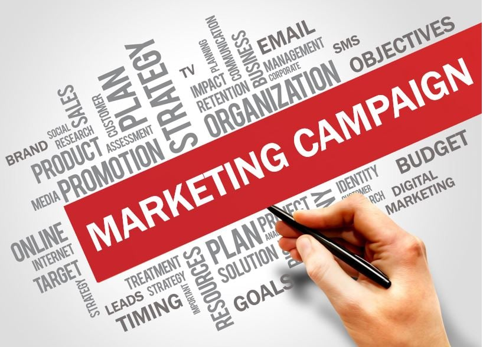
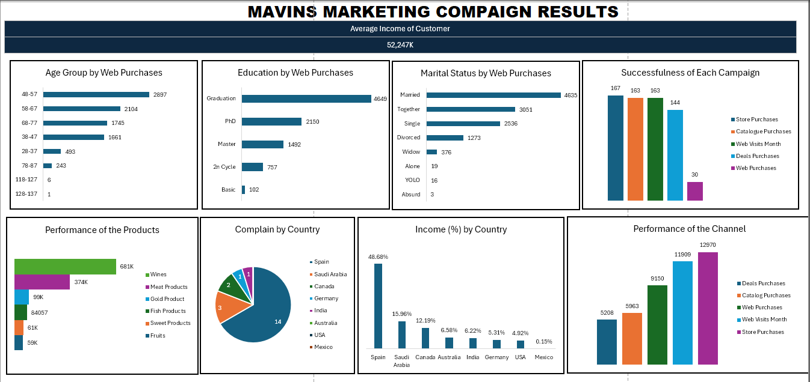

# MAVINS-MARKETING-COMPAIGN-ANALYSIS

Greetings fellow data Colleagues!

“Marketing campaign: A marketing campaign is an organized effort by a company to promote its products or services, increase brand awareness, and generate sales. It involves developing a strategy that outlines the tactics to be used, target audience, messaging, and budget. These efforts are designed to make a loud impact on potential customers, creating brand awareness, establishing trust and loyalty, and driving conversions.”
      

## Introduction
The data set was gotten from **Tina Okonkwo (@Rita_tyna)** pinned tweet on twitter, as project to test one excel knowledge.
First thing when I downloaded the dataset is I did a research on what marketing campaign means.  The main KPIs used in marketing campaigns are:
- Age
- Education
- Marital Status
After understanding the concept of marketing campaigns, I then checked the data dictionary given to know the questions to answer using the data.

## Problem Statement
- Which marketing campaign was the most successful?
- What does the average customer look like?
- Which products are performing best?
- Which channels are underperforming?
- Provide recommendations.

## Data Sourcing
I obtained the dataset from **Tina Okonkwo (@Rita_tyna)**. This dataset contains ID,	Year_Birth,	Age	Education,	Marital_Status,	 Income, 	Kidhome,	Teenhome,	Dt_Customer,	Recency,	MntWines,	MntFruits,	MntMeatProducts,	MntFishProducts,	MntSweetProducts,	MntGoldProds,	NumDealsPurchases,	NumWebPurchases,	NumCatalogPurchases,	NumStorePurchases,	NumWebVisitsMonth,	AcceptedCmp3,	AcceptedCmp4,	AcceptedCmp5,	AcceptedCmp1,	AcceptedCmp2,	Response,	Complain, 	Country columns.

To commence the data sourcing process, I navigated to the designated source and downloaded the dataset in CSV format. Following this, I extracted the CSV file into Microsoft Excel.
the table contains
- 2240 Rows
- 29 Columns
## Data Transformation/Cleaning
- Duplicates Removed
- Age column was calculated
- Formating to correct data type was done.

## Data Modeling
The project was done in Microsoft Excel. So, No modeling is needed

## Data Analysis and Visualization.

From the Dashboard, It is observed that 
INSIGHT
- Age, education, and marital status significantly affect the number of web purchases, indicating that targeting specific demographic 
  segments could lead to increased online sales.
- Store purchases, web visits, and catalogue purchases emerged as the most successful campaign channels, suggesting a focus on these 
  channels for future marketing efforts.
- Customers show a higher spending inclination towards wines, meat products, and gold items, signalling opportunities for targeted 
  promotions and product bundling strategies.
  As regard my own research, the reason why customers spent much on wine are;
   - High Antioxidant Content: it can help protect your cells from damage.
   - It lower your risk of developing heart disease.
   - Some research suggests that certain types of wine, such as red and white Riesling, can improve blood flow to the brain, potentially 
     reducing the risk of dementia and Alzheimer's
- Discount purchases and cataloge purchases channels performed poorly, indicating a need for reassessment or reallocation of resources to 
  more effective channels.
- Customers from Spain, Saudi Arabia, Canada, represent significant income sources, highlighting potential markets for targeted marketing 
  campaigns.
## Recommendation
1. Develop tailored marketing campaigns based on demographic insights, focusing on age, education level, and marital status to drive web 
   purchases.
2. Allocate resources towards store purchases, web visits, and catalog purchases channels, leveraging their success to maximize brand 
   exposure and increase sales.
3. Launch promotions and discounts on popular products such as wines, meat products, and gold items to capitalize on customer preferences 
   and drive sales.
4. Investigate reasons behind the underperformance of discount purchases and catalog purchases channels, and implement strategies to 
   enhance their effectiveness or consider reallocating resources to more profitable channels.
5. Invest in brand awareness initiatives through social media, influencer partnerships, and content marketing to enhance brand visibility 
   and attract new customers.
6. Implement customer engagement strategies such as loyalty programs, personalized recommendations, and interactive content to foster 
   stronger relationships and drive repeat purchases.
7. Continuously analyze customer data and campaign performance metrics to refine strategies, identify trends, and make informed decisions 
   for future marketing endeavors.
##

##

